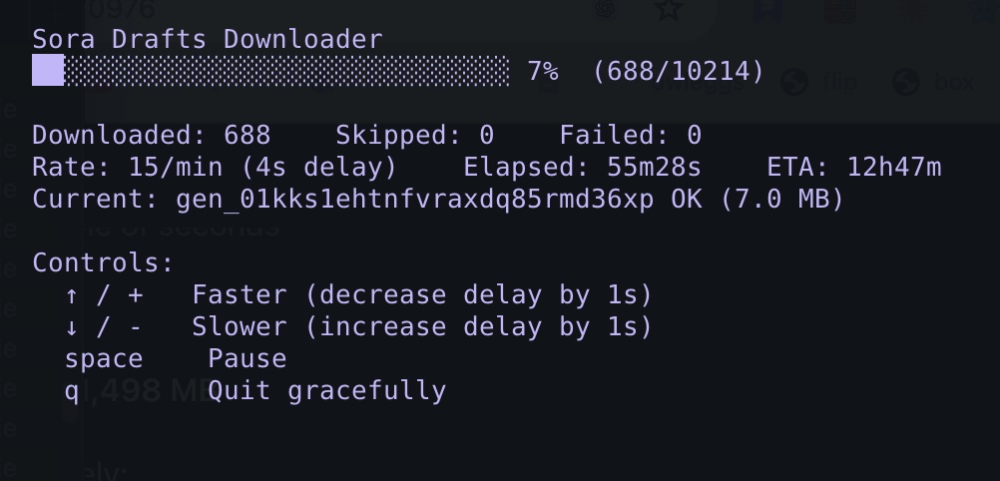

# Get Those Files Out - Sora exporter

*Based on work in the [sora-creator-tools](https://github.com/fancyson-ai/sora-creator-tools/) extension by the amazing [thecosmicskye](https://github.com/thecosmicskye), [cameoed](https://github.com/cameoed), [dblunk88](https://github.com/dblunk88), [fancyson-ai](https://github.com/fancyson-ai), [chrisbelson](https://github.com/chrisbelson), [lgcarrier](https://github.com/lgcarrier), [travisfischer](https://github.com/travisfischer), and [possum-kingdom](https://github.com/possum-kingdom) 🙌*

---

Export your content from [Sora](https://sora.chatgpt.com) before the service sunsets with configurable rate limiting, pause/resume, and deduplication handling.



Two flows:

**Drafts** (unposted generations)

1. **`capture-drafts.js`** -- Opens Chrome via Playwright, scrolls through your drafts page, and intercepts API responses to collect video download URLs.
2. **`download-drafts.js`** -- Reads the collected URLs and downloads each video with retry logic, rate limiting, and an interactive TUI.
3. **`backfill-prompts.js`** -- Walks the paginated drafts API and writes each draft's full metadata (prompt, creation_config, cast, kind, etc.) to `archive/<user>/drafts/<id>/draft.json`. Required for prompts and cast to show on draft pages.
4. **`thumbnail-drafts.js`** -- Extracts a still frame from each draft video with a parallel pool of `ffmpeg` workers and saves it as `thumbnail.jpg`. Required `ffmpeg` on your PATH.

**Profile** (posted videos, with descriptions, engagement, comments, and cast-ins — rendered as a browsable local HTML archive)

1. **`capture-profile.js`** -- Opens Chrome via Playwright, scrolls your profile page to collect post metadata from intercepted API responses (including `cameo_profiles`, the structured cast list), then fetches each post's comment tree via API with Retry-After-aware exponential backoff.
2. **`capture-cast-ins.js`** -- Same flow, but clicks the "Cast in" tab first and intercepts the `cut=appearances` feed — captures posts authored by other users where you were cast. Separate metadata dir (`_cast_ins/`) so the two sets don't collide.
3. **`build-archive.js`** -- Reads posts, cast-ins, and drafts metadata, downloads each post's video + thumbnail + cast-member avatars, and generates a browsable local HTML archive. The profile index has a Posts / Cast-in / Drafts tab switcher with per-tab search and sort. Every detail page (post, cast-in, draft) has a **Download video** button that saves the local mp4 with a slugified filename.
4. **`backfill-cast.js`** -- Refreshes the `post` object (including `cameo_profiles`) for already-captured posts. Use this if an older capture predates cast support, a cast member renamed, or you want to verify cast for a specific post.

## Prerequisites

- Node.js 18+
- Google Chrome installed
- `ffmpeg` on your PATH (only required for `thumbnail-drafts.js`)

## Setup

```bash
npm install
```

This installs Playwright (which drives Chrome). No separate `npx playwright install` is needed since the scripts use your existing Chrome installation (`channel: 'chrome'`).

## Usage — drafts

### Step 1: Capture draft URLs

```bash
node capture-drafts.js --username <your-sora-username>
```

1. **Quit Chrome completely** before running (Playwright needs to launch its own instance).
2. A Chrome window opens to `sora.chatgpt.com/drafts` -- log in.
3. Press **Enter** in the terminal once you can see your drafts.
4. The script auto-scrolls, capturing video URLs from API responses.
5. When no new URLs appear for 5 minutes, it pauses and asks if you want to continue.
6. URLs are saved to `archive/<username>/drafts.txt` (one per line, format: `id|url`).

### Step 2: Download videos

Run this in a separate terminal (can run while capture is still going):

```bash
node download-drafts.js --username <your-sora-username>
```

Videos are saved to `archive/<username>/drafts/<id>/video.mp4`.

**Interactive controls during download:**

| Key | Action |
|-----|--------|
| `Up` / `+` | Faster (decrease delay) |
| `Down` / `-` | Slower (increase delay) |
| `Space` | Pause / Resume |
| `q` | Quit gracefully |

### Step 3: Backfill prompts and cast metadata

`capture-drafts.js` only collects video URLs. To get each draft's prompt, cast, kind (sora_draft / sora_content_violation / sora_error / sora_paragen / storyboard), and other metadata, walk the paginated drafts API:

```bash
node backfill-prompts.js --username <your-sora-username>
```

Writes `archive/<username>/drafts/<id>/draft.json` and a plain-text `prompt.txt` per draft. Re-runs are incremental (existing `draft.json` is skipped unless `--rebuild`). Pass `--stop-on-known` to stop early once you hit drafts you already have.

### Step 4: Generate thumbnails

```bash
node thumbnail-drafts.js --username <your-sora-username>
```

Spawns a parallel pool of `ffmpeg` workers (default 4, adjustable with `↑`/`↓`) and writes `thumbnail.jpg` next to each `video.mp4`. Drafts with an existing thumbnail are skipped.

### Custom paths

`capture-drafts.js` and `download-drafts.js` accept env vars to override default paths:

```bash
DEST_DIR=/path/to/videos URLS_FILE=/path/to/drafts.txt node capture-drafts.js --username <user>
```

## Usage — profile archive

### Step 1: Capture profile metadata

```bash
node capture-profile.js --username <your-sora-username> [--refresh] [--comments-only]
```

1. **Quit Chrome completely** before running.
2. A Chrome window opens to `sora.chatgpt.com/profile/<username>` -- log in there.
3. The script auto-detects your session once you're logged in (or press Enter to force-proceed in a TTY).
4. **Phase 1 — scroll:** scrolls the profile page at 300px every 5s and saves post metadata from intercepted `/profile_feed` responses to `archive/<username>/_posts/<postId>.json`. Rides the app's natural request rate so you shouldn't see 429s here. When no new posts appear for 5 minutes, it asks whether to keep scrolling.
5. **Phase 2 — comments:** once discovery ends, it fetches each post's comment tree via API at 3s intervals with exponential backoff (10s → 30s → 90s → 300s, Retry-After honored) and auto-pauses after 5 consecutive 429/5xx failures so you can sort it out before rerunning.
6. Reruns are incremental — posts with `comments._pending: true` are retried, complete posts are skipped. Pass `--refresh` to ignore existing files and refetch everything. Hit `q` any time and rerun later to resume.
7. If you bailed out of an earlier run after Phase 1 discovered everything but Phase 2 didn't finish, pass `--comments-only` to skip the scroll and jump straight to fetching the missing comment trees — no need to wait another 5 minutes for the scroll phase to stall.

**Interactive controls during capture:**

| Key | Action |
|-----|--------|
| `Space` | Pause / Resume |
| `q` | Quit gracefully |

### Step 2: Build the HTML archive

Run in another terminal (can start while capture is still going — downloads hit Azure CDN, not Sora's API):

```bash
node build-archive.js --username <your-sora-username> [--rebuild]
```

This downloads each post's video + thumbnail with an interactive TUI (same controls as `download-drafts.js`) and writes the browsable HTML archive.

**Interactive controls during download:**

| Key | Action |
|-----|--------|
| `Up` / `+` | Faster (decrease delay by 1s) |
| `Down` / `-` | Slower (increase delay by 1s) |
| `Space` | Pause / Resume |
| `q` | Quit gracefully |

Reruns are incremental — videos that already exist (and are larger than 50 KB) are skipped. Pass `--rebuild` to force-regenerate the HTML from captured metadata without re-downloading videos. The profile `index.html` and `style.css` are rewritten on every run.

Before the video loop, `build-archive.js` does a fast pre-pass that deduplicates cast members across all posts and downloads each unique avatar once to `assets/avatars/<user_id>.jpg`. If an avatar fails to download, the HTML falls back to the original signed URL (which will stop working after Sora sunsets).

`build-archive.js` also indexes any drafts you've captured with `capture-drafts.js` / `download-drafts.js` / `backfill-prompts.js` / `thumbnail-drafts.js` and renders them into a third "Drafts" tab on the profile page.

Every detail page (post, cast-in, draft) includes a **Download video** button below the player. Clicking it saves the local mp4 with a slugified filename like `did-luckys-charm-offensive-bowl-us-over-69b9488b1244.mp4`. Files come straight from disk, so the button works offline once Sora is gone.

Open the result with:

```bash
open archive/<your-sora-username>/index.html
```

### Typical full-archive flow

```bash
# Replace <user> with your Sora username (e.g. the handle in sora.chatgpt.com/profile/<user>).

# 1. Capture your own posts (scroll + comments). Safe to q and resume anytime.
node capture-profile.js --username <user>

# 2. Capture cast-ins — posts authored by others where you were cast.
node capture-cast-ins.js --username <user>

# 3. Capture drafts — video URLs from your drafts page.
node capture-drafts.js --username <user>

# 4. Download draft videos.
node download-drafts.js --username <user>

# 5. Backfill draft metadata (prompts, cast, kind). Without this, drafts show up
#    with a "(no prompt captured)" placeholder.
node backfill-prompts.js --username <user>

# 6. Generate thumbnails for draft videos (requires ffmpeg).
node thumbnail-drafts.js --username <user>

# 7. Download post/cast-in videos + avatars + render HTML. Start this in a
#    second terminal alongside steps 1–2 if you want to overlap work —
#    build-archive only hits the Azure CDN, not Sora's API.
node build-archive.js --username <user>

# 8. If you bailed out of step 1 or 2 before the comment-fetch phase finished:
node capture-profile.js --username <user> --comments-only
node capture-cast-ins.js --username <user> --comments-only

# 9. Rebuild the HTML to pick up freshly-fetched comments (no re-downloads).
#    build-archive auto-rebuilds any page whose _posts/*.json or
#    _cast_ins/*.json or drafts/<id>/draft.json is newer than its index.html,
#    so --rebuild is only needed for layout tweaks.
node build-archive.js --username <user> --rebuild
```

### Refreshing cast-ins

`cameo_profiles` (the structured cast list) is captured automatically by `capture-profile.js`. If you have old `_posts/*.json` files that predate cast support, or want to pick up renamed handles and updated avatars:

```bash
# Only refresh posts where the cameo_profiles field is missing (fast)
node backfill-cast.js --username <user> --missing

# Refresh every captured post (slow but thorough)
node backfill-cast.js --username <user>

# Refresh a specific post (or a comma-separated list)
node backfill-cast.js --username <user> --ids s_abc123,s_def456

# Then rebuild the HTML
node build-archive.js --username <user> --rebuild
```

Same backoff + auto-pause behavior as `capture-profile.js` Phase 2. Comments in each post file are preserved.

## File structure

```
archive/
  <username>/
    profile.json                        # profile metadata
    index.html                          # Posts / Cast-in / Drafts tab switcher — open this
    style.css
    drafts.txt                          # captured draft IDs + signed URLs (id|url per line)
    assets/
      avatar.jpg                        # profile owner's avatar
      avatars/<user_id>.jpg             # cached avatars for every unique cast member
                                        #   (shared across posts + cast-ins + drafts)
    _posts/<postId>.json                # raw per-post metadata + cameo_profiles + comments
                                        #   (comments._pending=true until Phase 2 finishes)
    _cast_ins/<postId>.json             # same shape, for posts where you were cast
    posts/<postId>/
      video.mp4
      thumbnail.jpg
      index.html                        # post page: video + Download button + cast + comments
    cast_ins/<postId>/
      video.mp4
      thumbnail.jpg
      index.html                        # includes "Posted by @<author>" attribution
    drafts/<draftId>/
      video.mp4                         # download-drafts.js
      thumbnail.jpg                     # thumbnail-drafts.js
      draft.json                        # backfill-prompts.js (prompt, cast, kind, etc.)
      prompt.txt                        # plain-text prompt for grep convenience
      index.html                        # draft page: video + Download button + prompt + cast
    logs/
      capture.log                       # capture-profile.js
      capture-cast-ins.log              # capture-cast-ins.js
      drafts-download.log               # download-drafts.js
      drafts-backfill.log               # backfill-prompts.js
      drafts-thumbnail.log              # thumbnail-drafts.js
      build.log                         # build-archive.js
      backfill-cast.log                 # backfill-cast.js
```
